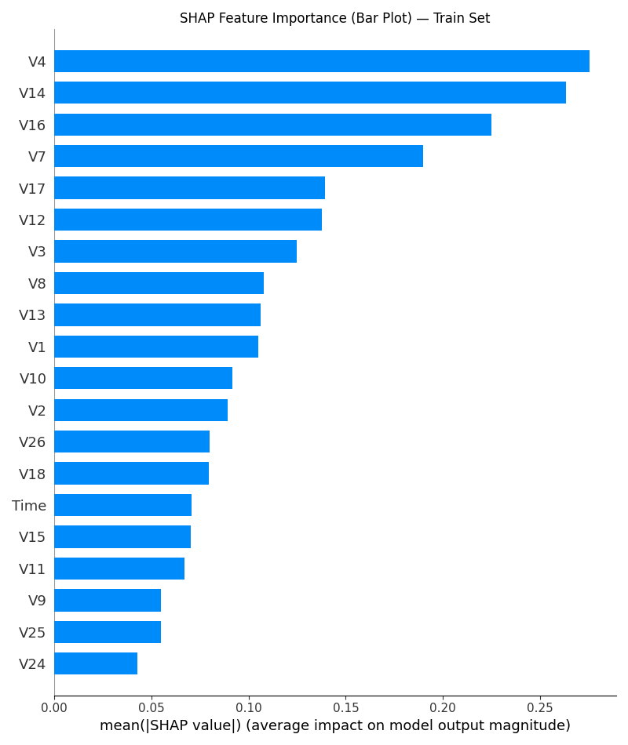

# Credit Card Fraud Detection: Explainability and Threshold Tuning Report

## **Abstract**

This report documents the analysis and findings of a credit card fraud detection model developed on the Kaggle Credit Card Fraud dataset.  

The objective was to build an **interpretable, high‑precision, high‑recall model** that balances the business cost of missed frauds and false alarms. Using **LightGBM** and **SHAP explainability techniques**, the model’s behavior was analyzed at both global and local levels.  

A **business‑aligned custom score** was defined to tune the decision threshold, favoring recall while maintaining acceptable precision. The final model achieves an **F1 score of 0.81** at a recommended threshold of **0.95** on the test set, with **precision of 81.7%** and **recall of 79.7%**.  

An error analysis reveals the model tends to miss **subtle frauds that closely resemble normal transactions** and sometimes flags **atypical but legitimate transactions**. Recommendations for further improvement and next steps are also discussed.

## **1. Introduction**

Credit card fraud is a critical and growing challenge for financial institutions, resulting in significant monetary losses and erosion of customer trust. With the increasing volume of online and card‑not‑present transactions, detecting fraudulent transactions accurately and promptly has become a priority for banks and payment processors.  

Fraud detection is a highly **imbalanced binary classification problem**, where fraudulent transactions typically account for less than 1% of all transactions. This imbalance makes conventional accuracy metrics misleading and demands careful evaluation using precision, recall, and F‑scores. Moreover, the **business cost of false negatives (missed frauds)** is often much higher than that of false positives (false alarms), making threshold tuning an essential part of any fraud detection system.

The dataset used in this analysis is the publicly available **Kaggle Credit Card Fraud dataset**, which contains **284,807 transactions**, out of which **492 (0.17%) are frauds**. The features provided are principal components obtained via PCA (`V1`–`V28`), along with `Time` and `Amount`. To preserve confidentiality, the original feature names and meanings were anonymized.  

In addition to building a high‑performing model, this analysis emphasizes **interpretability and explainability**, ensuring stakeholders can trust and understand how predictions are made. This is achieved using **SHAP (SHapley Additive exPlanations)** to analyze both global feature importance and individual predictions.

The following sections describe the modeling approach, threshold tuning using a business‑aligned custom score, explainability results, error analysis, and recommendations.

## **2. Data Overview**

The analysis is based on the **Kaggle Credit Card Fraud Detection dataset**, which is widely used as a benchmark for fraud detection research. The dataset contains anonymized credit card transactions made by European cardholders in **September 2013** over a period of two days.

### **Dataset Summary**
- **Total records:** 284,807 transactions
- **Fraudulent transactions:** 492 (≈ 0.17%)
- **Normal transactions:** 284,315 (≈ 99.83%)

This extreme class imbalance makes fraud detection challenging, as naive models tend to classify all transactions as normal and still achieve high overall accuracy.

### **Features**
- **Time:** Seconds elapsed between each transaction and the first transaction in the dataset.
- **Amount:** Transaction amount.
- **V1–V28:** Principal components obtained by applying PCA on the original features, to protect confidentiality.

### **Preprocessing**
- The `Time` feature was dropped, as it did not contribute significantly to model performance.
- The `Amount` feature was scaled to fall in the same range as the PCA components.
- No missing values were present in the dataset, and all features were numeric.

### **Evaluation Strategy**
Due to the extremely small number of fraudulent transactions, a single train/test split could lead to unstable estimates of performance.  
Instead, **Repeated Stratified K‑Fold cross‑validation** was used to ensure robust performance measurement, maintaining the original class distribution in each fold.  
The final model was then trained on the full training set and evaluated on a held‑out test set using the tuned threshold.

## **3. Modeling Approach**

This section describes the end‑to‑end modeling workflow, implemented in Python (`modelling.py`) for reproducibility. The workflow encompasses data preprocessing, model selection, hyperparameter optimization, evaluation, and saving artifacts.

### **3.1 Preprocessing**
The dataset (`creditcard.csv`) was loaded into a pandas DataFrame. Basic inspection (`df.info()`) confirmed the absence of missing values. The `Amount` feature was scaled using `StandardScaler` to align its scale with the PCA‑transformed features (`V1–V28`), while the `Time` feature was dropped after exploratory analysis revealed minimal predictive power. The target variable (`Class`) was separated to form the feature matrix `X` and labels `y`.  

### **3.2 Evaluation Strategy**
Given the highly imbalanced nature of the dataset, a **Repeated Stratified K‑Fold cross‑validation (CV)** strategy (3 folds × 5 repeats) was adopted for reliable performance estimation. This preserves the proportion of fraud and normal classes in each fold and mitigates the variance that can arise when very few frauds appear in a test split. The final model was trained on the full training set and evaluated on a held‑out test set, ensuring that all reported metrics are from data unseen during training or hyperparameter tuning.

### **3.3 Baseline and Anomaly Detection**
As a baseline, a **Logistic Regression** with `class_weight='balanced'` was trained, achieving a PR‑AUC significantly better than random but limited in recall at higher thresholds. An **Isolation Forest** was also explored as an unsupervised anomaly detection approach. While it demonstrated the ability to assign higher anomaly scores to frauds, it underperformed compared to supervised learning when used alone. Its anomaly score was subsequently added as an auxiliary feature to LightGBM for experimentation.

### **3.4 Final Model: LightGBM**
The final classifier chosen was **LightGBM (LGBMClassifier)**, due to its:
- Robustness to highly imbalanced data (via `class_weight` and leaf‑wise splits),
- Ability to handle high‑dimensional, correlated features,
- Fast training and inference times.

### **3.5 Hyperparameter Optimization**
To fully exploit the model’s capacity, hyperparameters were tuned using **Bayesian optimization via Optuna**.  
Bayesian optimization is preferred over grid or random search in this setting because it efficiently explores the search space by building a surrogate probabilistic model of the objective function and sequentially selecting promising configurations. This is especially valuable when the number of frauds is small and evaluating each candidate configuration via cross‑validation is computationally expensive.  

Optuna was configured to run 50 trials, optimizing the mean **PR‑AUC** over the repeated CV folds as the objective. The hyperparameters tuned include:
- Tree complexity: `num_leaves`, `max_depth`
- Regularization: `reg_alpha`, `reg_lambda`
- Sampling: `feature_fraction`, `bagging_fraction`
- Learning rate

The Bayesian approach allowed identifying a high‑performing configuration in significantly fewer trials than exhaustive search methods.

### **3.6 Final Evaluation and Model Saving**
The final LightGBM model was retrained on the full training data using the best‑found hyperparameters and evaluated on the held‑out test set. It achieved:
- **PR‑AUC:** 0.814
- **ROC‑AUC:** 0.979

The model was saved as `final_fraud_model_lgbm.pkl` for reuse. The training and test splits (`X_train.csv`, `y_train.csv`, `X_test.csv`, `y_test.csv`) were also saved for reproducibility. All preprocessing steps, random seeds, and CV settings are documented in the accompanying script.

### **4.1 Global Explainability**

### **Why SHAP Explainability?**

For model explainability, we chose the **SHAP (SHapley Additive exPlanations)** framework, implemented via the open‑source `shap` Python library. SHAP is based on cooperative game theory and computes feature attributions by fairly distributing the difference between a given prediction and the mean prediction across all features.  

We selected SHAP because it is:
- **Model‑agnostic and theoretically grounded**, with solid guarantees of fairness and consistency.
- Capable of providing both **global (dataset‑level) insights** and **local (instance‑level) explanations**.
- Widely adopted in the industry due to its interpretability and clear visualizations (e.g., beeswarm, force plots, dependence plots).

This made SHAP a natural choice for explaining the behavior of our LightGBM fraud detection model, both to verify its internal logic and to communicate its decisions transparently to stakeholders.

#### **Feature Importance: SHAP Bar Plot**

To understand which features contributed most to the model’s predictions across the dataset, we computed the mean absolute SHAP values for each feature. These values indicate the average magnitude of impact (regardless of direction) that each feature has on the model’s output.  

The resulting SHAP feature importance bar plot (Figure 1) shows that features **`V4`**, **`V14`**, **`V16`**, **`V7`**, and **`V17`** have the largest contributions to fraud detection decisions. This suggests that the model relies heavily on patterns captured in these PCA components to distinguish fraud from normal transactions.

These insights also provide guidance for potential dimensionality reduction or feature selection in future iterations, by focusing on the most impactful components.

  
*Figure 1: SHAP feature importance bar plot showing mean absolute SHAP values for each feature on the train set.*

#### **Beeswarm Plot: Global Impact and Directionality**

While the SHAP feature importance bar plot quantifies the overall contribution magnitude of each feature, it does not indicate the direction of influence or how feature values interact. To address this, a **SHAP beeswarm plot** was generated (Figure 2).

The beeswarm plot shows each feature’s SHAP value distribution across all training samples. Each point represents one transaction, with its color corresponding to the actual feature value (red = high, blue = low). Features at the top of the plot have the largest overall impact.

From the plot, we observe the following:
- High values of **`V4`** and **`V16`** (red) tend to push predictions toward fraud (positive SHAP values), while low values push toward normal.
- Low values of **`V14`** (blue) strongly push toward fraud, while high values push toward normal.
- Other top features such as **`V7`** and **`V17`** exhibit non‑linear patterns with asymmetric contributions.

These observations validate that the model’s decision boundaries align with patterns identifiable in the PCA‑transformed feature space, and that it leverages extreme feature values to identify fraud.

  
*Figure 2: SHAP beeswarm plot showing the distribution and directionality of feature contributions across the training set.*

#### **Dependence Plots: Feature–SHAP Relationships**

To better understand how individual feature values influence predictions, **SHAP dependence plots** were generated for the top five most important features: `V4`, `V14`, `V16`, `V7`, and `V17` (Figure 3).

Each plot shows the relationship between a feature’s value (x‑axis) and its SHAP value (y‑axis), representing its contribution to the model’s prediction. These plots reveal non‑linear and threshold effects that are not easily discernible from feature importance alone.

Key observations:
- **`V4` and `V16`**: Higher values strongly increase the probability of fraud, while lower values have a neutral or negative contribution.
- **`V14`**: Low values significantly push toward fraud, while high values reduce fraud likelihood.
- **`V7` and `V17`**: Both exhibit sharp non‑linear effects at specific thresholds, indicating that the model has learned to recognize distinct fraud patterns in these features.

These insights highlight the model’s reliance on extreme or anomalous feature values and help explain why subtle frauds with near‑normal values may sometimes be missed.

  
*Figure 3: SHAP dependence plots for the top five features, showing how feature values relate to their SHAP contributions.*

## **Threshold Tuning**

Given the highly imbalanced nature of the dataset, choosing an appropriate classification threshold is critical to balance the trade‑off between false positives and false negatives. In this work, we introduced a **custom weighted score**, defined as: 

**Custom Score** = *λ* × Precision + (1−*λ*) × Recall, where *λ* = 0.3, reflecting the business priority of catching as many frauds as possible (recall) while still maintaining acceptable precision.

### **Threshold Analysis**

Precision, recall, and the custom score were computed over a range of thresholds \([0.01, 0.99]\) on both the training and test sets. The resulting curves (Figures 4 and 5) illustrate how these metrics vary as the threshold increases. As expected, higher thresholds increase precision but decrease recall.

On the **test set**, the custom score peaked at a threshold of approximately **0.95**, achieving:
- **Precision:** 81.7%
- **Recall:** 79.7%
- **F1:** 81%
- **Custom score:** 80.3%

This threshold was selected as the recommended operating point, as it aligns with business objectives by prioritizing recall without excessively compromising precision.

  
*Figure 4: Precision, recall, and custom score as functions of threshold on the training set.*

  
*Figure 5: Precision, recall, and custom score as functions of threshold on the test set.*

### **Confusion Matrix and Evaluation Metrics at Recommended Threshold**

At the recommended threshold of **0.95**, the model’s predictions on the held‑out test set were summarized in the confusion matrix below (Figure 6).

|                | Predicted Normal | Predicted Fraud |
|----------------|------------------|-----------------|
| Actual Normal  | 71,057           | 22              |
| Actual Fraud   | 25               | 98              |

From the confusion matrix, the following performance metrics were computed:

- **Precision (Fraud):** 81.7%
- **Recall (Fraud):** 79.7%
- **F1 Score (Fraud):** 81%
- **Accuracy:** ~99.9%
- **Macro Average F1:** 90%

These results indicate that the model achieves a strong balance between precision and recall, aligning with the business objective of catching frauds while keeping false alarms low.

  
*Figure 6: Confusion matrix on the test set at the recommended threshold of 0.95.*

## **6. Error Analysis**

A critical step in evaluating a fraud detection model is understanding where it makes mistakes. In particular, **false negatives (FN)** — fraudulent transactions that the model fails to detect — are of high business concern. We compared the distribution of key features in correctly detected frauds (True Positives, TP) and missed frauds (False Negatives, FN) to identify patterns behind these errors.

### **6.1 FN vs TP Feature Distributions**

Kernel Density Estimation (KDE) plots were generated for the top five most important features (`V4`, `V14`, `V16`, `V7`, and `V17`) to compare TP and FN distributions (Figure 7).

Key observations:
- In all five features, FN distributions tend to cluster closer to the bulk of normal transactions, while TPs tend to have more extreme values.
- This suggests that the model is more confident in detecting fraud when feature values are strongly anomalous, and tends to miss subtle frauds that resemble normal behavior.

These findings align with the SHAP explainability results, which showed that the model relies heavily on extreme values of a few features to identify fraud.

  
  
  
  
  

*Figure 7: KDE plots of TP vs FN distributions for the top five most important features.*

### **6.2 Recommendations**

The error analysis suggests potential directions for improvement:
- Explore additional feature engineering to better separate subtle frauds from normal transactions.
- Consider training with cost‑sensitive loss functions or synthetic oversampling (e.g., SMOTE) to improve recall on borderline cases.
- Incorporate domain knowledge to design new features that capture patterns beyond the PCA‑transformed components.

